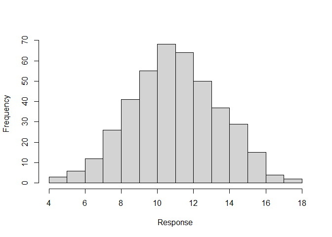
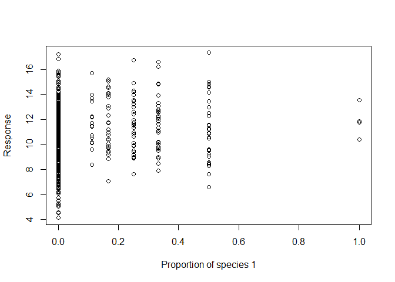

<!-- README.md is generated from README.Rmd. Please edit that file -->

# DImodels

<!-- badges: start -->

[](https://github.com/rafamoral/DImodels/actions/workflows/R-CMD-check.yaml)
[](https://CRAN.R-project.org/package=DImodels)
[](https://zenodo.org/badge/latestdoi/610857928)
[](https://app.codecov.io/gh/rafamoral/DImodels?branch=main)
<!-- badges: end -->

The `DImodels` package is designed to make fitting
Diversity-Interactions models easier. Diversity-Interactions (DI) models
(Kirwan et al 2009) are a set of tools for analysing and interpreting
data from experiments that explore the effects of species diversity
(from a pool of *S* species) on community-level responses. Data suitable
for DI models will include (at least) for each experimental unit: a
response recorded at a point in time, and a set of proportions of *S*
species $p_1$, $p_2$, …, $p_S$ from a point in time prior to the
recording of the response. The proportions sum to 1 for each
experimental unit.

**Main changes in the package from version 1.0 to version 1.1 and
newer**

- `DI_data_prepare` is now superseded by `DI_data` (see examples below)

## `DImodels` installation and load

The `DImodels` package is installed from CRAN and loaded in the typical
way.

``` r
install.packages("DImodels")
library("DImodels")
```

You can install the development version of DImodels from
[GitHub](https://github.com/) with:

``` r
# install.packages("devtools")
devtools::install_github("rafamoral/DImodels")
```

## Accessing an introduction to Diversity-Introductions models

It is recommended that users unfamiliar with Diversity-Interactions (DI)
models read the introduction to `DImodels`, before using the package.
Run the following code to access the documentation.

``` r
?DImodels
```

## Datasets included in the DImodels package

There are seven example datasets included in the `DImodels` package:
`Bell`, `sim1`, `sim2`, `sim3`, `sim4`, `sim5`, `Switzerland`. Details
about each of these datasets is available in their associated help
files, run this code, for example:

``` r
?sim3
```

In this vignette, we will describe the `sim3` dataset and show a worked
analysis of it.

## The sim3 dataset

The `sim3` dataset was simulated from a functional group (FG)
Diversity-Interactions model. There were nine species in the pool, and
it was assumed that species 1 to 5 come from functional group 1, species
6 and 7 from functional group 2 and species 8 and 9 from functional
group 3, where species in the same functional group are assumed to have
similar traits. The following equation was used to simulate the data.

$$ y = \sum_{i=1}^{9}\beta_ip_i + \omega_{11}\sum_{\substack{i,j = 1 \\ i<j}}^5p_ip_j + \omega_{22}p_6p_7 + \omega_{33}p_8p_9 \\ + \omega_{12}\sum_{\substack{i \in {1,2,3,4,5} \\ j \in {6,7}}}p_ip_j + \omega_{13}\sum_{\substack{i \in {1,2,3,4,5} \\ j \in {8,9}}}p_ip_j + \omega_{23}\sum_{\substack{i \in {6,7} \\ j \in {8,9}}}p_ip_j + \gamma_k + \epsilon$$
Where $\gamma_k$ is a treatment effect with two levels (*k = 1,2*) and
$\epsilon$ was assumed IID N(0, $\sigma^2$). The parameter values are in
the following table.

| Parameter | Value |         | Parameter     | Value |
|-----------|-------|---------|---------------|-------|
| $\beta_1$ | 10    |         | $\omega_{11}$ | 2     |
| $\beta_2$ | 9     |         | $\omega_{22}$ | 3     |
| $\beta_3$ | 8     |         | $\omega_{33}$ | 1     |
| $\beta_4$ | 7     |         | $\omega_{12}$ | 4     |
| $\beta_5$ | 11    |         | $\omega_{13}$ | 9     |
| $\beta_6$ | 6     |         | $\omega_{23}$ | 3     |
| $\beta_7$ | 5     |         | $\gamma_1$    | 3     |
| $\beta_8$ | 8     |         | $\gamma_2$    | 0     |
| $\beta_9$ | 9     |         | $\sigma$      | 1.2   |

Here, the non-linear parameter $\theta$ that can be included as a power
on each $p_ip_j$ component of each interaction variable (Connolly et al
2013) was set equal to one and thus does not appear in the equation
above.

The 206 rows of proportions contained in the dataset `design_a`
(supplied in the package) were used to simulate the `sim3` dataset. Here
is the first few rows from `design_a`:

| community | richness |  p1 |  p2 |  p3 |  p4 |  p5 |  p6 |  p7 |  p8 |  p9 |
|----------:|---------:|----:|----:|----:|----:|----:|----:|----:|----:|----:|
|         1 |        1 |   0 |   0 |   0 |   0 |   0 |   0 |   0 |   0 |   1 |
|         1 |        1 |   0 |   0 |   0 |   0 |   0 |   0 |   0 |   0 |   1 |
|         2 |        1 |   0 |   0 |   0 |   0 |   0 |   0 |   0 |   1 |   0 |
|         2 |        1 |   0 |   0 |   0 |   0 |   0 |   0 |   0 |   1 |   0 |
|         3 |        1 |   0 |   0 |   0 |   0 |   0 |   0 |   1 |   0 |   0 |
|         3 |        1 |   0 |   0 |   0 |   0 |   0 |   0 |   1 |   0 |   0 |

Where `community` is an identifier for unique sets of proportions and
`richness` is the number of species in the community.

The proportions in `design_a` were replicated over two treatment levels,
giving a total of 412 rows in the simulated dataset. The `sim3` data can
be loaded and viewed in the usual way.

``` r
data("sim3")
knitr::kable(head(sim3, 10))
```

| community | richness | treatment |  p1 |  p2 |  p3 |  p4 |  p5 |  p6 |  p7 |  p8 |  p9 | response |
|----------:|---------:|:----------|----:|----:|----:|----:|----:|----:|----:|----:|----:|---------:|
|         1 |        1 | A         |   0 |   0 |   0 |   0 |   0 |   0 |   0 |   0 |   1 |   10.265 |
|         1 |        1 | B         |   0 |   0 |   0 |   0 |   0 |   0 |   0 |   0 |   1 |    7.740 |
|         1 |        1 | A         |   0 |   0 |   0 |   0 |   0 |   0 |   0 |   0 |   1 |   12.173 |
|         1 |        1 | B         |   0 |   0 |   0 |   0 |   0 |   0 |   0 |   0 |   1 |    8.497 |
|         2 |        1 | A         |   0 |   0 |   0 |   0 |   0 |   0 |   0 |   1 |   0 |   10.763 |
|         2 |        1 | B         |   0 |   0 |   0 |   0 |   0 |   0 |   0 |   1 |   0 |    8.989 |
|         2 |        1 | A         |   0 |   0 |   0 |   0 |   0 |   0 |   0 |   1 |   0 |   10.161 |
|         2 |        1 | B         |   0 |   0 |   0 |   0 |   0 |   0 |   0 |   1 |   0 |    7.193 |
|         3 |        1 | A         |   0 |   0 |   0 |   0 |   0 |   0 |   1 |   0 |   0 |   10.171 |
|         3 |        1 | B         |   0 |   0 |   0 |   0 |   0 |   0 |   1 |   0 |   0 |    6.053 |

## Exploring the data

There are several graphical displays that will help to explore the data
and it may also be useful to generate summary statistics.

``` r
hist(sim3$response, xlab = "Response", main = "")
```



``` r
# Similar graphs can also be generated for the other species proportions.
plot(sim3$p1, sim3$response, xlab = "Proportion of species 1", ylab = "Response")
```



``` r
summary(sim3$response)
#>    Min. 1st Qu.  Median    Mean 3rd Qu.    Max. 
#>   4.134   9.327  10.961  10.994  12.604  17.323
```

## Implementing an automated DI model fitting process using `autoDI`

The function `autoDI` in `DImodels` provides a way to do an automated
exploratory analysis to compare a range of DI models. It works through a
set of automated steps (Steps 1 to 4) and will select the ‘best’ model
from the range of models that have been explored and test for lack of
fit in that model. The selection process is not exhaustive, but provides
a useful starting point in analysis using DI models.

``` r
auto1 <- autoDI(y = "response", prop = 4:12, treat = "treatment", 
                FG = c("FG1","FG1","FG1","FG1","FG1","FG2","FG2","FG3","FG3"), data = sim3, 
                selection = "Ftest")
#> 
#> --------------------------------------------------------------------------------
#> Step 1: Investigating whether theta is equal to 1 or not for the AV model, including all available structures
#> 
#> Theta estimate: 0.9714
#> Selection using F tests
#>            Description                                                       
#> DI Model 1 Average interactions 'AV' DImodel with treatment                  
#> DI Model 2 Average interactions 'AV' DImodel with treatment, estimating theta
#> 
#>            DI_model       treat estimate_theta Resid. Df Resid. SSq Resid. MSq
#> DI Model 1       AV 'treatment'          FALSE       401   694.3095     1.7314
#> DI Model 2       AV 'treatment'           TRUE       400   693.7321     1.7343
#>            Df    SSq     F Pr(>F)
#> DI Model 1                       
#> DI Model 2  1 0.5775 0.333 0.5642
#> 
#> The test concludes that theta is not significantly different from 1.
#> 
#> --------------------------------------------------------------------------------
#> Step 2: Investigating the interactions
#> Since 'Ftest' was specified as selection criterion and functional groups were specified, dropping the ADD model as it is not nested within the FG model.
#> Selection using F tests
#>            Description                                                 
#> DI Model 1 Structural 'STR' DImodel with treatment                     
#> DI Model 2 Species identity 'ID' DImodel with treatment                
#> DI Model 3 Average interactions 'AV' DImodel with treatment            
#> DI Model 4 Functional group effects 'FG' DImodel with treatment        
#> DI Model 5 Separate pairwise interactions 'FULL' DImodel with treatment
#> 
#>            DI_model       treat estimate_theta Resid. Df Resid. SSq Resid. MSq
#> DI Model 1      STR 'treatment'          FALSE       410  1496.1645     3.6492
#> DI Model 2       ID 'treatment'          FALSE       402   841.2740     2.0927
#> DI Model 3       AV 'treatment'          FALSE       401   694.3095     1.7314
#> DI Model 4       FG 'treatment'          FALSE       396   559.7110     1.4134
#> DI Model 5     FULL 'treatment'          FALSE       366   522.9727     1.4289
#>            Df      SSq        F  Pr(>F)
#> DI Model 1                             
#> DI Model 2  8 654.8905  57.2903 <0.0001
#> DI Model 3  1 146.9645 102.8524 <0.0001
#> DI Model 4  5 134.5985  18.8396 <0.0001
#> DI Model 5 30  36.7383    0.857   0.686
#> 
#> Selected model: Functional group effects 'FG' DImodel with treatment
#> 
#> --------------------------------------------------------------------------------
#> Step 3: Investigating the treatment effect
#> Selection using F tests
#>            Description                                         
#> DI Model 1 Functional group effects 'FG' DImodel               
#> DI Model 2 Functional group effects 'FG' DImodel with treatment
#> 
#>            DI_model       treat estimate_theta Resid. Df Resid. SSq Resid. MSq
#> DI Model 1       FG        none          FALSE       397   1550.682     3.9060
#> DI Model 2       FG 'treatment'          FALSE       396    559.711     1.4134
#>            Df      SSq      F  Pr(>F)
#> DI Model 1                           
#> DI Model 2  1 990.9711 701.12 <0.0001
#> 
#> Selected model: Functional group effects 'FG' DImodel with treatment
#> 
#> --------------------------------------------------------------------------------
#> Step 4: Comparing the final selected model with the reference (community) model
#> 'community' is a factor with 100 levels, one for each unique set of proportions.
#> 
#>                model Resid. Df Resid. SSq Resid. MSq Df      SSq     F Pr(>F)
#> DI Model 1  Selected       396   559.7110     1.4134                         
#> DI Model 2 Reference       311   445.9889     1.4340 85 113.7222 0.933 0.6423
#> 
#> --------------------------------------------------------------------------------
#> autoDI is limited in terms of model selection. Exercise caution when choosing your final model.
#> --------------------------------------------------------------------------------
```

The output of `autoDI`, works through the following process:

1.  Step 1 fitted the average interactions (`AV`) model and uses profile
    likelihood to estimate the non-linear parameter $\theta$ and tests
    whether or not it differs from one. $\theta$ was estimated to be
    0.96814 and was not significantly different from one ($p = 0.4572$).
    Therefore, subsequent steps assumed $\theta=1$ when fitting the DI
    models.
2.  Step 2 fitted five different DI models, each with a different form
    of species interactions and treatment was always included. The
    functional group model (FG) was the selected model. This assumes
    that pairs of species interact according to functional group
    membership.
3.  Step 3 provided a test for the treatment and indicated that the
    treatment, included as an additive factor, was significant and
    needed in the model ($p < 0.0001$).
4.  Step 4 provides a lack of fit test, here there was no indication of
    lack of fit in the model selected in Step 3 ($p = 0.6423$).

Further details on each of these steps are available in the `autoDI`
help file. Run the following code to access the documentation.

``` r
?autoDI
```

All parameter estimates from the selected model can be viewed using
`summary`.

``` r
summary(auto1)
#> 
#> Call:
#> glm(formula = new_fmla, family = family, data = new_data)
#> 
#> Deviance Residuals: 
#>     Min       1Q   Median       3Q      Max  
#> -3.8425  -0.8141   0.0509   0.8048   3.5657  
#> 
#> Coefficients:
#>                Estimate Std. Error t value Pr(>|t|)    
#> p1               9.7497     0.3666  26.595  < 2e-16 ***
#> p2               8.5380     0.3672  23.253  < 2e-16 ***
#> p3               8.2329     0.3666  22.459  < 2e-16 ***
#> p4               6.3644     0.3665  17.368  < 2e-16 ***
#> p5              10.8468     0.3669  29.561  < 2e-16 ***
#> p6               5.9621     0.4515  13.205  < 2e-16 ***
#> p7               5.4252     0.4516  12.015  < 2e-16 ***
#> p8               7.3204     0.4515  16.213  < 2e-16 ***
#> p9               8.2154     0.4515  18.196  < 2e-16 ***
#> FG_bfg_FG1_FG2   3.4395     0.8635   3.983 8.09e-05 ***
#> FG_bfg_FG1_FG3  11.5915     0.8654  13.395  < 2e-16 ***
#> FG_bfg_FG2_FG3   2.8711     1.2627   2.274  0.02351 *  
#> FG_wfg_FG1       2.8486     0.9131   3.120  0.00194 ** 
#> FG_wfg_FG2       0.6793     2.3553   0.288  0.77319    
#> FG_wfg_FG3       2.4168     2.3286   1.038  0.29997    
#> treatmentA       3.1018     0.1171  26.479  < 2e-16 ***
#> ---
#> Signif. codes:  0 '***' 0.001 '**' 0.01 '*' 0.05 '.' 0.1 ' ' 1
#> 
#> (Dispersion parameter for gaussian family taken to be 1.413412)
#> 
#>     Null deviance: 52280.33  on 412  degrees of freedom
#> Residual deviance:   559.71  on 396  degrees of freedom
#> AIC: 1329.4
#> 
#> Number of Fisher Scoring iterations: 2
```

If the final model selected by autoDI includes a value of theta other
than 1, then a 95% confidence interval for $\theta$ can be generated
using the `theta_CI` function:

``` r
theta_CI(auto1, conf = .95)
```

Here, this code would not run, since the final model selected by
`autoDI` does not include theta estimated.

## Fitting individual models using the `DI` function

For some users, the selection process in `autoDI` will be sufficient,
however, most users will fit additional models using `DI`. For example,
while the treatment is included in `autoDI` as an additive factor,
interactions between treatment and other model terms are not considered.
Here, we will first fit the model selected by `autoDI` using `DI` and
then illustrate the capabilities of `DI` to fit specialised models.

### Fitting the final model selected by `autoDI` using `DI`

``` r
m1 <- DI(y = "response", prop = 4:12, 
         FG = c("FG1","FG1","FG1","FG1","FG1","FG2","FG2","FG3","FG3"), treat = "treatment", 
         DImodel = "FG", data = sim3)
#> Warning in DI_data_prepare(y = y, block = block, density = density, prop = prop, : One or more rows have species proportions that sum to approximately 1, but not exactly 1. This is typically a rounding issue, and has been corrected internally prior to analysis.
#> Fitted model: Functional group effects 'FG' DImodel
summary(m1)
#> 
#> Call:
#> glm(formula = new_fmla, family = family, data = new_data)
#> 
#> Deviance Residuals: 
#>     Min       1Q   Median       3Q      Max  
#> -3.8425  -0.8141   0.0509   0.8048   3.5657  
#> 
#> Coefficients:
#>                Estimate Std. Error t value Pr(>|t|)    
#> p1               9.7497     0.3666  26.595  < 2e-16 ***
#> p2               8.5380     0.3672  23.253  < 2e-16 ***
#> p3               8.2329     0.3666  22.459  < 2e-16 ***
#> p4               6.3644     0.3665  17.368  < 2e-16 ***
#> p5              10.8468     0.3669  29.561  < 2e-16 ***
#> p6               5.9621     0.4515  13.205  < 2e-16 ***
#> p7               5.4252     0.4516  12.015  < 2e-16 ***
#> p8               7.3204     0.4515  16.213  < 2e-16 ***
#> p9               8.2154     0.4515  18.196  < 2e-16 ***
#> FG_bfg_FG1_FG2   3.4395     0.8635   3.983 8.09e-05 ***
#> FG_bfg_FG1_FG3  11.5915     0.8654  13.395  < 2e-16 ***
#> FG_bfg_FG2_FG3   2.8711     1.2627   2.274  0.02351 *  
#> FG_wfg_FG1       2.8486     0.9131   3.120  0.00194 ** 
#> FG_wfg_FG2       0.6793     2.3553   0.288  0.77319    
#> FG_wfg_FG3       2.4168     2.3286   1.038  0.29997    
#> treatmentA       3.1018     0.1171  26.479  < 2e-16 ***
#> ---
#> Signif. codes:  0 '***' 0.001 '**' 0.01 '*' 0.05 '.' 0.1 ' ' 1
#> 
#> (Dispersion parameter for gaussian family taken to be 1.413412)
#> 
#>     Null deviance: 52280.33  on 412  degrees of freedom
#> Residual deviance:   559.71  on 396  degrees of freedom
#> AIC: 1329.4
#> 
#> Number of Fisher Scoring iterations: 2
```

### Re-fitting the final model selected by `autoDI` estimating theta using `update_DI`

``` r
m1_theta <- update_DI(object = m1, estimate_theta = TRUE)
#> Warning in DI_data_prepare(y = y, block = block, density = density, prop = prop, : One or more rows have species proportions that sum to approximately 1, but not exactly 1. This is typically a rounding issue, and has been corrected internally prior to analysis.
#> Fitted model: Functional group effects 'FG' DImodel
#> Theta estimate: 0.9681
coef(m1_theta)
#>             p1             p2             p3             p4             p5 
#>      9.8128865      8.6069092      8.2968619      6.4287580     10.9110563 
#>             p6             p7             p8             p9 FG_bfg_FG1_FG2 
#>      6.0189395      5.4846833      7.4038925      8.2992262      2.9840924 
#> FG_bfg_FG1_FG3 FG_bfg_FG2_FG3     FG_wfg_FG1     FG_wfg_FG2     FG_wfg_FG3 
#>     10.6019235      2.3514998      2.3737831      0.3789464      1.8470612 
#>     treatmentA          theta 
#>      3.1017864      0.9681005
```

## Fitting customised models using the `DI` function

There are two ways to fit customised models using `DI`; the first is by
using the option `DImodel =` in the `DI` function and adding the
argument `extra_formula =` to it, and the second is to use the
`custom_formula` argument in the `DI` function. If species interaction
variables (e.g., the FG interactions or the average pairwise
interaction) are included in either `extra_formula` or `custom_formula`,
they must first be created and included in the dataset. The function
`DI_data` can be used to compute several types of species interaction
variables.

### Including treatment by species identity term interactions using `extra_formula`

``` r
m2 <- DI(y = "response", prop = 4:12, 
         FG = c("FG1","FG1","FG1","FG1","FG1","FG2","FG2","FG3","FG3"), treat = "treatment", 
         DImodel = "FG", extra_formula = ~ (p1 + p2 + p3 + p4):treatment,
         data = sim3)
#> Warning in DI_data_prepare(y = y, block = block, density = density, prop = prop, : One or more rows have species proportions that sum to approximately 1, but not exactly 1. This is typically a rounding issue, and has been corrected internally prior to analysis.
#> Fitted model: Functional group effects 'FG' DImodel
summary(m2)
#> 
#> Call:
#> glm(formula = new_fmla, family = family, data = new_data)
#> 
#> Deviance Residuals: 
#>     Min       1Q   Median       3Q      Max  
#> -3.6892  -0.7859   0.0436   0.7781   3.6227  
#> 
#> Coefficients:
#>                  Estimate Std. Error t value Pr(>|t|)    
#> p1               9.391824   0.540485  17.377  < 2e-16 ***
#> p2               8.492825   0.540879  15.702  < 2e-16 ***
#> p3               8.406038   0.540471  15.553  < 2e-16 ***
#> p4               6.015296   0.540391  11.131  < 2e-16 ***
#> p5              10.802270   0.378776  28.519  < 2e-16 ***
#> p6               5.917565   0.461482  12.823  < 2e-16 ***
#> p7               5.380703   0.461535  11.658  < 2e-16 ***
#> p8               7.275881   0.461506  15.766  < 2e-16 ***
#> p9               8.170907   0.461471  17.706  < 2e-16 ***
#> FG_bfg_FG1_FG2   3.439508   0.865279   3.975 8.38e-05 ***
#> FG_bfg_FG1_FG3  11.591458   0.867140  13.367  < 2e-16 ***
#> FG_bfg_FG2_FG3   2.871063   1.265295   2.269  0.02381 *  
#> FG_wfg_FG1       2.848612   0.915008   3.113  0.00199 ** 
#> FG_wfg_FG2       0.679285   2.360195   0.288  0.77365    
#> FG_wfg_FG3       2.416774   2.333420   1.036  0.30097    
#> treatmentA       3.190868   0.216493  14.739  < 2e-16 ***
#> `p1:treatmentB`  0.626667   0.668369   0.938  0.34902    
#> `p2:treatmentB`  0.001213   0.668369   0.002  0.99855    
#> `p3:treatmentB` -0.435322   0.668369  -0.651  0.51522    
#> `p4:treatmentB`  0.609180   0.668369   0.911  0.36262    
#> ---
#> Signif. codes:  0 '***' 0.001 '**' 0.01 '*' 0.05 '.' 0.1 ' ' 1
#> 
#> (Dispersion parameter for gaussian family taken to be 1.419257)
#> 
#>     Null deviance: 52280.33  on 412  degrees of freedom
#> Residual deviance:   556.35  on 392  degrees of freedom
#> AIC: 1335
#> 
#> Number of Fisher Scoring iterations: 2
```

### Including treatment by species interaction terms using `extra_formula`

First, we create the FG pairwise interactions, using the `DI_data`
function with the `what` argument set to `"FG"`.

``` r
FG_matrix <- DI_data(prop = 4:12, FG = c("FG1","FG1","FG1","FG1","FG1","FG2","FG2","FG3","FG3"), 
                     data = sim3, what = "FG")
sim3a <- data.frame(sim3, FG_matrix)
```

Then we fit the model using `extra_formula`.

``` r
m3 <- DI(y = "response", prop = 4:12, 
         FG = c("FG1","FG1","FG1","FG1","FG1","FG2","FG2","FG3","FG3"),
         treat = "treatment", DImodel = "FG", 
         extra_formula = ~ (bfg_FG1_FG2 + bfg_FG1_FG3 + bfg_FG2_FG3 +
                              wfg_FG1 + wfg_FG2 + wfg_FG3) : treatment, data = sim3a)
#> Warning in DI_data_prepare(y = y, block = block, density = density, prop = prop, : One or more rows have species proportions that sum to approximately 1, but not exactly 1. This is typically a rounding issue, and has been corrected internally prior to analysis.
#> Fitted model: Functional group effects 'FG' DImodel
summary(m3)
#> 
#> Call:
#> glm(formula = new_fmla, family = family, data = new_data)
#> 
#> Deviance Residuals: 
#>     Min       1Q   Median       3Q      Max  
#> -3.8251  -0.8208   0.0554   0.7982   3.4218  
#> 
#> Coefficients:
#>                          Estimate Std. Error t value Pr(>|t|)    
#> p1                        9.68668    0.40000  24.217  < 2e-16 ***
#> p2                        8.47495    0.40053  21.159  < 2e-16 ***
#> p3                        8.16990    0.39998  20.426  < 2e-16 ***
#> p4                        6.30140    0.39987  15.759  < 2e-16 ***
#> p5                       10.78379    0.40031  26.938  < 2e-16 ***
#> p6                        5.89908    0.47958  12.301  < 2e-16 ***
#> p7                        5.36222    0.47963  11.180  < 2e-16 ***
#> p8                        7.25740    0.47960  15.132  < 2e-16 ***
#> p9                        8.15243    0.47957  17.000  < 2e-16 ***
#> FG_bfg_FG1_FG2            4.00191    1.12383   3.561 0.000415 ***
#> FG_bfg_FG1_FG3           11.77389    1.12973  10.422  < 2e-16 ***
#> FG_bfg_FG2_FG3            3.83681    1.64287   2.335 0.020027 *  
#> FG_wfg_FG1                2.81860    1.16226   2.425 0.015757 *  
#> FG_wfg_FG2               -1.58378    3.11717  -0.508 0.611682    
#> FG_wfg_FG3                1.32358    3.07561   0.430 0.667181    
#> treatmentA                3.22783    0.33480   9.641  < 2e-16 ***
#> `treatmentA:bfg_FG1_FG2` -1.12480    1.43053  -0.786 0.432178    
#> `treatmentA:bfg_FG1_FG3` -0.36487    1.44450  -0.253 0.800717    
#> `treatmentA:bfg_FG2_FG3` -1.93150    2.09024  -0.924 0.356029    
#> `treatmentA:wfg_FG1`      0.06003    1.42911   0.042 0.966517    
#> `treatmentA:wfg_FG2`      4.52613    4.06260   1.114 0.265924    
#> `treatmentA:wfg_FG3`      2.18638    3.99748   0.547 0.584733    
#> ---
#> Signif. codes:  0 '***' 0.001 '**' 0.01 '*' 0.05 '.' 0.1 ' ' 1
#> 
#> (Dispersion parameter for gaussian family taken to be 1.42436)
#> 
#>     Null deviance: 52280.3  on 412  degrees of freedom
#> Residual deviance:   555.5  on 390  degrees of freedom
#> AIC: 1338.3
#> 
#> Number of Fisher Scoring iterations: 2
```

### Fitting only a subset of the FG interaction terms using `custom_formula`

First, we create a dummy variable for level A of the treatment (this is
required for the `glm` engine that is used within `DI` and because there
is no intercept in the model).

``` r
sim3a$treatmentA <- as.numeric(sim3a$treatment == "A")
```

Then we fit the model using `custom_formula`.

``` r
m3 <- DI(y = "response",
         custom_formula = response ~ 0 + p1 + p2 + p3 + p4 + p5 + p6 + p7 + p8 + p9 +
           treatmentA + bfg_FG1_FG2 + bfg_FG1_FG3 + bfg_FG2_FG3, data = sim3a)
#> Fitted model: Custom DI model
summary(m3)
#> 
#> Call:
#> glm(formula = custom_formula, family = family, data = data)
#> 
#> Deviance Residuals: 
#>     Min       1Q   Median       3Q      Max  
#> -4.0272  -0.7831   0.0404   0.7570   3.7016  
#> 
#> Coefficients:
#>             Estimate Std. Error t value Pr(>|t|)    
#> p1           10.3417     0.3138  32.957  < 2e-16 ***
#> p2            9.1766     0.3103  29.573  < 2e-16 ***
#> p3            8.8268     0.3134  28.164  < 2e-16 ***
#> p4            6.9742     0.3122  22.341  < 2e-16 ***
#> p5           11.4422     0.3141  36.426  < 2e-16 ***
#> p6            5.9177     0.3994  14.815  < 2e-16 ***
#> p7            5.3967     0.3999  13.496  < 2e-16 ***
#> p8            7.4468     0.3983  18.695  < 2e-16 ***
#> p9            8.3449     0.3984  20.945  < 2e-16 ***
#> treatmentA    3.1018     0.1184  26.198  < 2e-16 ***
#> bfg_FG1_FG2   2.9359     0.8042   3.651 0.000296 ***
#> bfg_FG1_FG3  10.8896     0.8343  13.053  < 2e-16 ***
#> bfg_FG2_FG3   2.9410     1.2233   2.404 0.016667 *  
#> ---
#> Signif. codes:  0 '***' 0.001 '**' 0.01 '*' 0.05 '.' 0.1 ' ' 1
#> 
#> (Dispersion parameter for gaussian family taken to be 1.443887)
#> 
#>     Null deviance: 52280.33  on 412  degrees of freedom
#> Residual deviance:   576.11  on 399  degrees of freedom
#> AIC: 1335.3
#> 
#> Number of Fisher Scoring iterations: 2
```

## References

Connolly J, T Bell, T Bolger, C Brophy, T Carnus, JA Finn, L Kirwan, F
Isbell, J Levine, A Lüscher, V Picasso, C Roscher, MT Sebastia, M Suter
and A Weigelt (2013) An improved model to predict the effects of
changing biodiversity levels on ecosystem function. Journal of Ecology,
101, 344-355.

Kirwan L, J Connolly, JA Finn, C Brophy, A Lüscher, D Nyfeler and MT
Sebastia (2009) Diversity-interaction modelling - estimating
contributions of species identities and interactions to ecosystem
function. Ecology, 90, 2032-2038.
